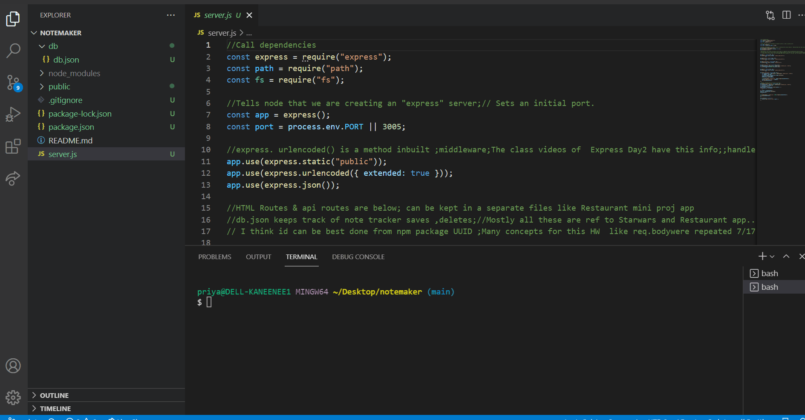

# notemaker
* Notetaker add notes-you add a suitable title and text and save .The title and text gets saved on the left side panel.You can retrieve any text at random by clicking title on the left panel.A delete feature is also provided.When you refresh the page the contents remain the same.
* Challenges -Heroku installation which hit multiple roadblocks.
* Thanks to my instructor for working with me on the Heroku installation , BCSLA support for giving me alternate ideas to deploy app other than the class material provided ;Thanks to my tutor Alexis San Javier who helped me on this homework and deployment .
 Deployed link   https://intense-plateau-60002.herokuapp.com/

Visual 

